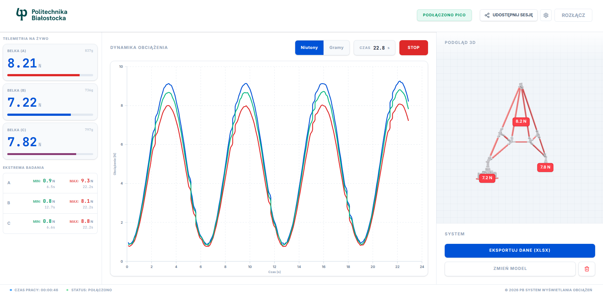
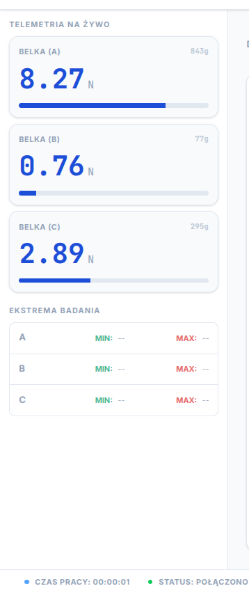
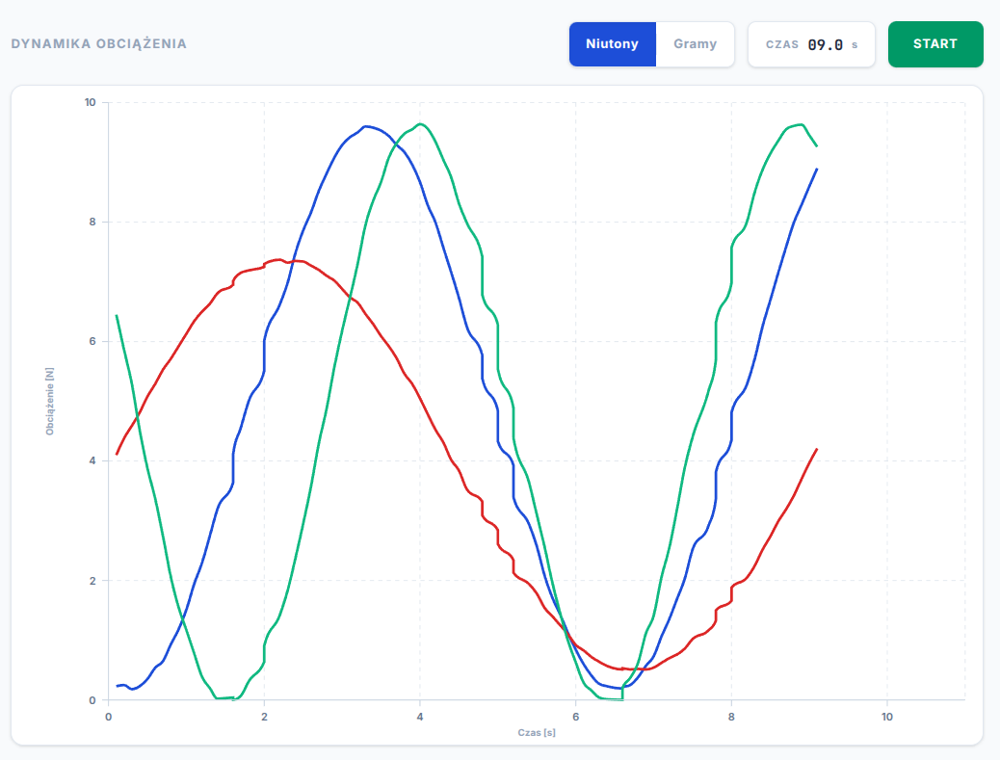
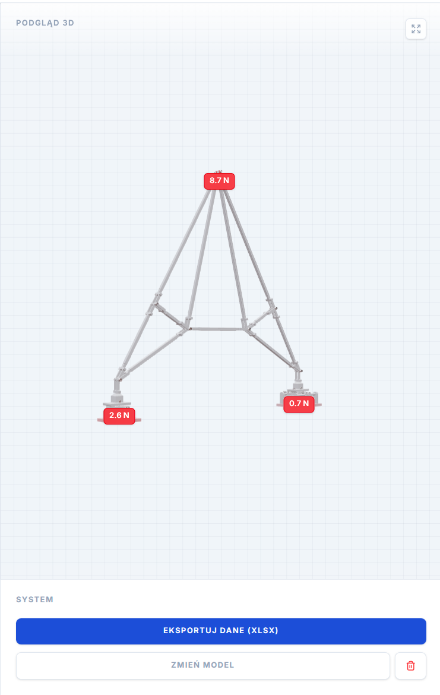
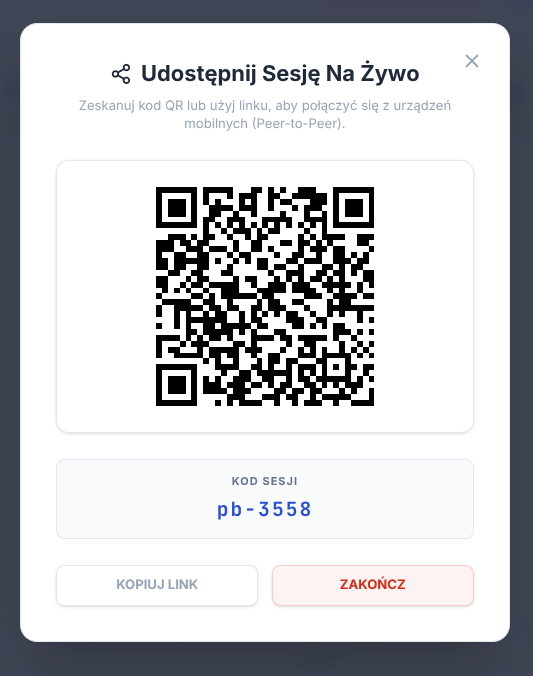

# Truss Digital Twin | System monitorowania obciążeń

> Read this in: [English](./README.en.md)



Projekt inżynierski łączący sprzęt pomiarowy z nowoczesną aplikacją webową. Umożliwia rejestrowanie sił działających na poszczególne elementy kratownicy w czasie rzeczywistym, ich wizualizację na interaktywnym wykresie oraz nakładanie wyników bezpośrednio na trójwymiarowy model konstrukcji.

---

## Co robi ta aplikacja?

Czujniki tensometryczne podłączone do Raspberry Pi Pico mierzą siły (w gramach i niutonach) na wybranych belkach kratownicy. Dane trafiają przez USB do przeglądarki, gdzie użytkownik może je obserwować na żywo, nagrywać sesję pomiarową, a następnie analizować wyniki lub wyeksportować je do arkusza kalkulacyjnego.

Drugi duży moduł to wizualizacja 3D, użytkownik może wczytać własny model geometryczny (format GLTF/GLB) i przypisać czujniki do konkretnych elementów. Od tej chwili model żyje, belki zmieniają kolor proporcjonalnie do działającej na nie siły, czerwony oznacza rozciąganie, niebieski ściskanie.

Całość można też udostępnić w czasie rzeczywistym innym urządzeniom za pomocą jednego kliknięcia, bez żadnego serwera.

---

## Struktura projektu

```
truss-digital-twin/
├── Raspberry Pico/          # Oprogramowanie mikrokontrolera (MicroPython)
│   ├── hx711.py             # Sterownik przetwornika ADC HX711
│   └── main.py              # Logika odczytu i wysyłki danych JSON
│
└── web/                     # Aplikacja webowa (React + Vite)
    └── src/
        ├── components/
        │   ├── layout/      # Nagłówek, boczne panele, nawigacja mobilna
        │   ├── telemetry/   # Wykresy i karty z danymi czujników
        │   ├── tutorial/    # Kreator pierwszego uruchomienia
        │   └── visualization/ # Silnik 3D (Three.js)
        ├── store/           # Globalny stan aplikacji (Zustand)
        └── utils/           # Zarządzanie portem szeregowym, sesją P2P, modelem
```

---

## Jak to uruchomić?

### Raspberry Pi Pico

1. Podłącz czujniki HX711 do pinów GPIO zgodnie z konfiguracją w `main.py` (domyślnie czujniki A, B, C na parach pinów 2/3, 4/5, 6/7).
2. Wgraj pliki `hx711.py` oraz `main.py` na Pico za pomocą Thonny lub mpremote.
3. Uruchom `main.py` - Pico zacznie wysyłać pakiety JSON przez USB co kilka milisekund.

> Przed pierwszym użyciem konieczna jest kalibracja każdego czujnika (wyznaczenie wartości `tara` i `wspolczynnik`). Wartości te wpisuje się ręcznie w `main.py`.

### Aplikacja webowa

Wymagany Node.js w wersji 18 lub nowszej.

```bash
cd web
npm install
npm run dev
```

Aplikacja domyślnie startuje na `http://localhost:5173` i jest dostępna w sieci lokalnej (flaga `--host`).

Po otwarciu strony kreator poprowadzi przez pierwsze kroki - podłączenie Pico i opcjonalne wczytanie modelu 3D.

---

## Stos technologiczny

### Sprzęt

**Raspberry Pi Pico + HX711** - mikrokontroler odczytuje dane z przetworników analogowo-cyfrowych HX711, które są standardem w wagach elektronicznych. Pico wybrano ze względu na niską cenę, prostotę programowania w MicroPython i natywną obsługę USB. HX711 operuje z rozdzielczością 24 bitów, co przekłada się na bardzo wysoką czułość pomiaru.

Firmware stosuje uśrednianie kroczące z odrzucaniem wartości skrajnych (tzw. trimmed mean), co znacznie redukuje szumy elektryczne bez wprowadzania zauważalnych opóźnień.

### Warstwa webowa

**React 19** - biblioteka do budowania interfejsu użytkownika. Komponenty reagują automatycznie na zmiany stanu, co jest szczególnie przydatne przy strumieniu danych napływających kilkanaście razy na sekundę.

**Vite** - narzędzie do budowania i uruchamiania projektu deweloperskiego. Oferuje błyskawiczny cold start i odświeżanie modułów bez przeładowania strony.

**Tailwind CSS 4** - narzędzie do stylowania. Zamiast pisać osobne pliki CSS, style opisuje się bezpośrednio przy komponentach za pomocą klas, co przyspiesza pracę i eliminuje martwego kodu.

**Zustand** - minimalistyczna biblioteka do zarządzania stanem aplikacji. Przechowuje aktualne odczyty z czujników, historię nagrania, konfigurację mappingu 3D i status połączenia. Wybrana zamiast Redux ze względu na znacznie prostszą składnię przy zachowaniu pełnej funkcjonalności.

**Web Serial API** - natywne API przeglądarki (Chrome/Edge) umożliwiające bezpośrednią komunikację z urządzeniami USB bez instalowania żadnych sterowników ani rozszerzeń. Mikrokontroler wysyła linie JSON, aplikacja je parsuje i aktualizuje stan.

**PeerJS** - biblioteka upraszczająca korzystanie z WebRTC do połączeń peer-to-peer. Umożliwia udostępnienie sesji innym urządzeniom przez skan kodu QR - dane telemetryczne i model 3D są przesyłane bezpośrednio między przeglądarkami, z pominięciem serwera. Dane binarne modelu są serializowane jako `ArrayBuffer`, co pozwala ominąć ograniczenia serializacji JSON narzucone przez bibliotekę.

**Three.js + @react-three/fiber + @react-three/drei** - trójka bibliotek odpowiedzialna za silnik 3D. Three.js to rdzeń renderujący scenę OpenGL w elemencie Canvas. React Three Fiber to "mostek" integrujący Three.js z drzewem komponentów Reacta. Drei dostarcza gotowe komponenty wyższego rzędu, jak `OrbitControls`, `Bounds` (automatyczne dopasowanie kamery do modelu) czy `ContactShadows`.

**Recharts** - biblioteka wykresów oparta na SVG. Używana do rysowania wykresu czasowego obciążeń.

**SheetJS (xlsx)** - obsługa eksportu danych do formatu `.xlsx`. Umożliwia zapisanie całej zarejestrowanej sesji do pliku Excela jednym kliknięciem, bez komunikacji z żadnym serwerem. Plik generowany jest w całości po stronie przeglądarki.

**qrcode.react** - generowanie kodu QR z linkiem do sesji. Link zawiera identyfikator hosta P2P; po zeskanowaniu przez inne urządzenie automatycznie nawiązywane jest połączenie.

**idb-keyval** - prosta abstrakcja nad IndexedDB (lokalną bazą danych przeglądarki). Służy do persystencji plików modelu 3D między sesjami, dzięki temu model nie znika po odświeżeniu strony.

**Lucide React** - zestaw ikon SVG. Spójny styl ikon w całym interfejsie.

---

## Główne funkcje

**Telemetria na żywo** - po podłączeniu Pico karty czujników aktualizują się w czasie rzeczywistym. Jednostkę można przełączać między niutonami a gramami.



**Nagrywanie sesji** - przycisk START/STOP zbiera historię odczytów z dokładnością do 0,1 sekundy. Panel boczny pokazuje wartości minimalne i maksymalne dla każdej belki z dokładnym znacznikiem czasu.



**Wizualizacja 3D** - użytkownik importuje model w formacie GLTF lub GLB (np. wyeksportowany z Blendera). Po wczytaniu klika wybrany element siatki i przypisuje mu czujnik. Model zmienia kolory proporcjonalnie do aktualnego obciążenia.



**Udostępnianie sesji** - host generuje kod QR, goście otwierają link na telefonie lub innym komputerze i widzą dokładnie to samo co host, dane telemetryczne i model 3D, bez instalowania czegokolwiek.



**Eksport do Excela** - zarejestrowana sesja trafia do pliku `.xlsx` z kolumnami dla każdego czujnika w obu jednostkach.

**Kreator pierwszego uruchomienia** - przy pierwszym otwarciu aplikacji wyświetla się interaktywny wizard z instrukcjami krok po kroku.

---

## Wymagania systemowe

| Element | Minimalne wymaganie |
|---|---|
| Przeglądarka | Google Chrome lub Microsoft Edge (Web Serial API) |
| Node.js | ≥ 18 |
| System operacyjny hosta | Windows, macOS, Linux |
| Mikrokontroler | Raspberry Pi Pico (RP2040) |
| Przetwornik ADC | HX711 |

Przeglądarki Firefox i Safari nie są obsługiwane ze względu na brak implementacji Web Serial API.

---

## Autor

Projekt zrealizowany jako projekt na przedmiot **Praca W Zespole Politechnika Białostocka**. Łączy elementy elektroniki analogowej (pomiar siły), programowania mikrokontrolerów oraz nowoczesnej inżynierii webowej (React, Zustand, Three.js, WebRTC, WebGL).